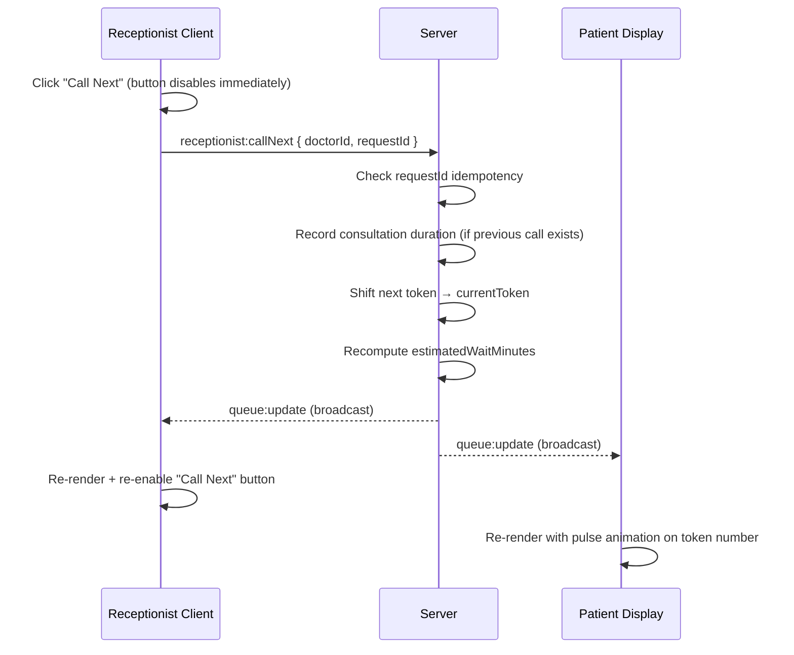
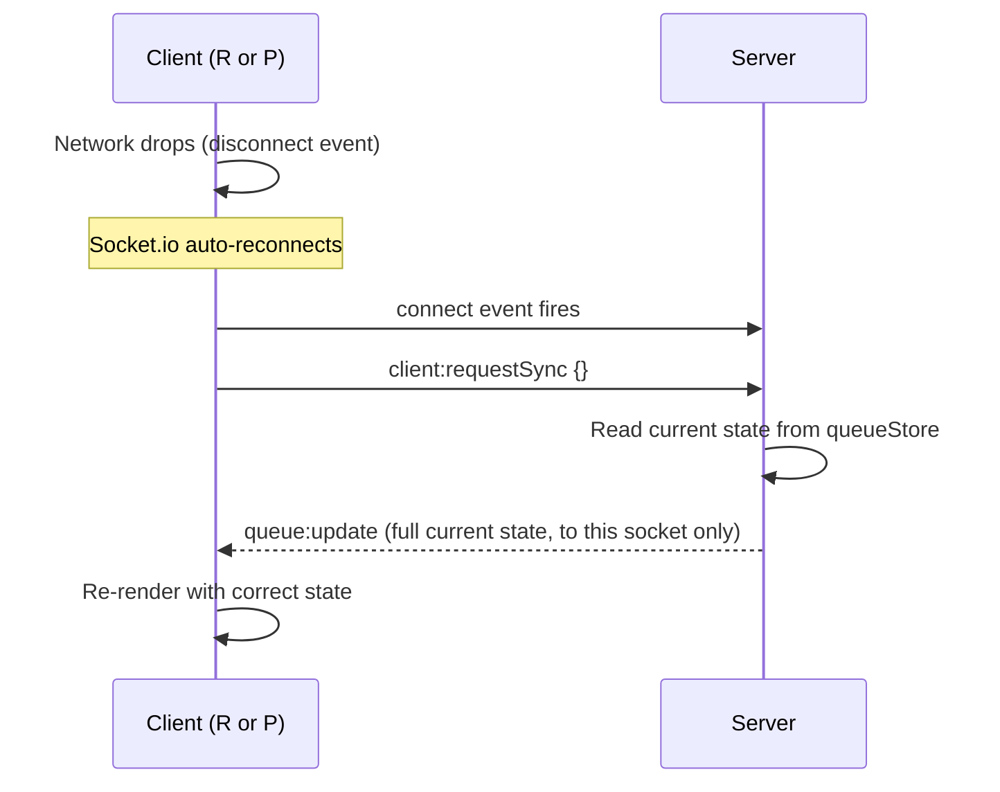
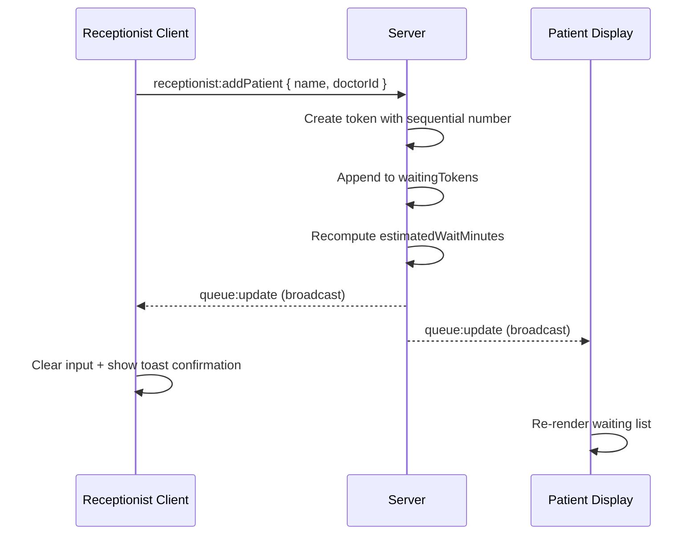
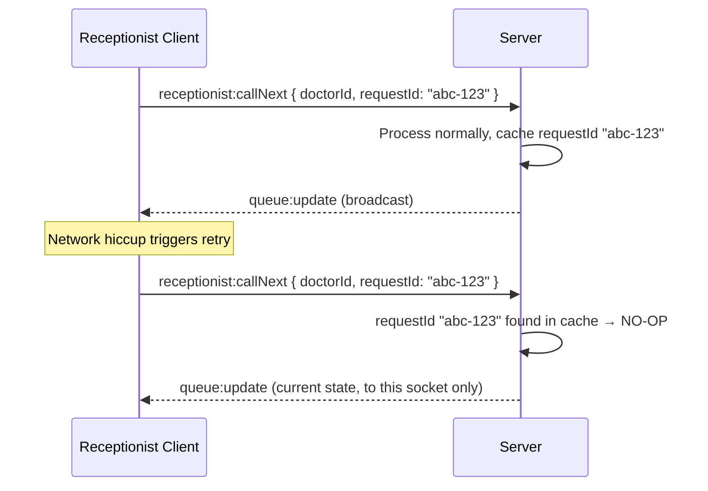
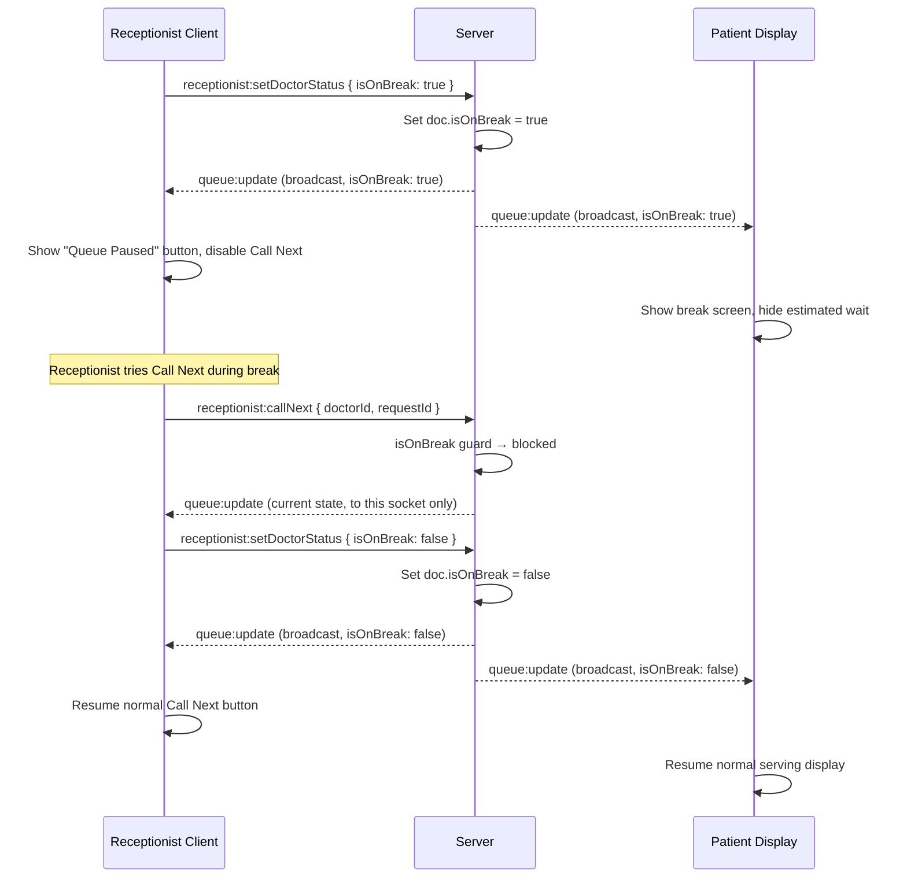

# Socket Event Contract

All socket event names, payloads, and flows used by Queue Cure '26.

---

## Event Table

### Client → Server

| Event Name | Payload | Description |
|---|---|---|
| `receptionist:addPatient` | `{ name: string, doctorId: string }` | Add a new patient to the queue |
| `receptionist:callNext` | `{ doctorId: string, requestId: string }` | Call the next patient. `requestId` is a client-generated UUID for idempotency |
| `receptionist:undoLastCall` | `{ doctorId: string }` | Revert the last "Call Next" action |
| `receptionist:setAvgConsultTime` | `{ doctorId: string, minutes: number }` | Update the manual average consultation time (cold-start fallback) |
| `receptionist:setDoctorStatus` | `{ doctorId: string, isOnBreak: boolean }` | Pause or resume the queue for a doctor break |
| `client:requestSync` | `{}` | Sent automatically on connect/reconnect to get current full state |

### Server → All Clients (broadcast)

| Event Name | Payload | Description |
|---|---|---|
| `queue:update` | See payload below | Broadcast after every mutation and on every new connection |

#### `queue:update` Payload

```json
{
  "doctorId": "string",
  "currentToken": { "id": "string", "name": "string", "tokenNumber": 12 },
  "waitingTokens": [{ "id": "string", "name": "string", "tokenNumber": 13 }],
  "avgConsultMinutes": 8,
  "estimatedWaitMinutes": 24,
  "lastUpdated": "2026-06-17T00:00:00.000Z",
  "canUndo": true,
  "realDataPoints": 3,
  "isOnBreak": false
}
```

`currentToken` is `null` when no patient is being served.

---

## Sequence Diagrams

### Normal Flow — "Call Next" Action



### Reconnection Flow — Client Catches Up to Current State



### Add Patient Flow



### Idempotent "Call Next" — Duplicate Request Handling



### Doctor Break Flow


